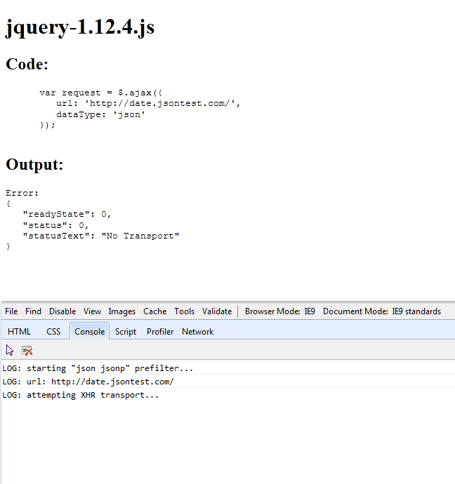
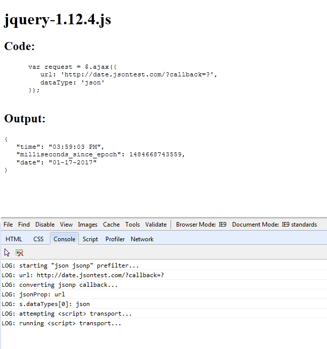
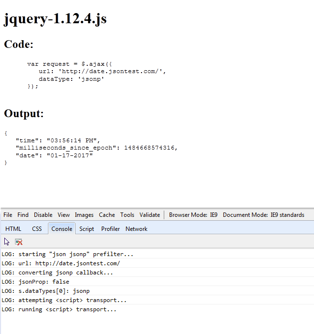

# `jQuery.ajax()` JSONP Examples in IE9

The [jQuery `.ajax()` docs](http://api.jquery.com/jQuery.ajax/) seem to suggest a request with a `dataType` of `json` request to an external domain will result in a JSONP call. (Please note bold)

> `"json"`: Evaluates the response as JSON and returns a JavaScript object. ***Cross-domain `"json"` requests are converted to `"jsonp"` unless the request includes `jsonp: false` in its request options.*** The JSON data is parsed in a strict manner; any malformed JSON is rejected and a parse error is thrown. As of jQuery 1.9, an empty response is also rejected; the server should return a response of null or {} instead. (See json.org for more information on proper JSON formatting.)

Below are some basic examples of how a JSON/JSONP API may be called. In most modern browsers with support for CORS all the requests will succeed. However, a basic JSON request will _not_ be upgraded to a JSONP request as the docs seem to indicate.

(Note: The `jsonp` setting for `$.ajax` defaults to `callback`)

## Basic Cross Domain JSON Request ([source](json-upgrade-jsonp_1.12.4.html))

```js
$.ajax({
   url: 'http://date.jsontest.com/',
   dataType: 'json'
});
```

### Notes:

- This request fails in IE9 (Reason: "No Transport")
- This request will be successful when ran in a browser that supports CORS (Requested via the `XHR` transport)

### IE9 Results:




## JSON Request with Callback Parameter ([source](json-with-callback_1.12.4.html))

```js
$.ajax({
   url: 'http://date.jsontest.com/?callback=?',
   dataType: 'json'
});
```

### Notes:

- This request will be successful in IE9
- This request uses the `<script>` transport even if the browser supports CORS
- Is this the "upgrade" that the docs are referring to?

### IE9 Results:




## JSONP Request ([source](jsonp-datatype_1.12.4.html))

```js
$.ajax({
   url: 'http://date.jsontest.com/',
   dataType: 'jsonp'
});
```

### Notes:

- This request will be successful in IE9
- This request uses the `<script>` transport even if the browser supports CORS

### IE9 Results:


